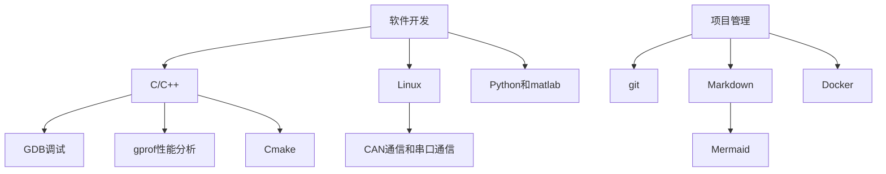
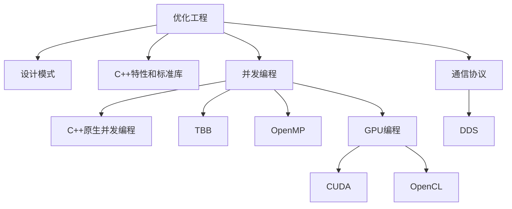
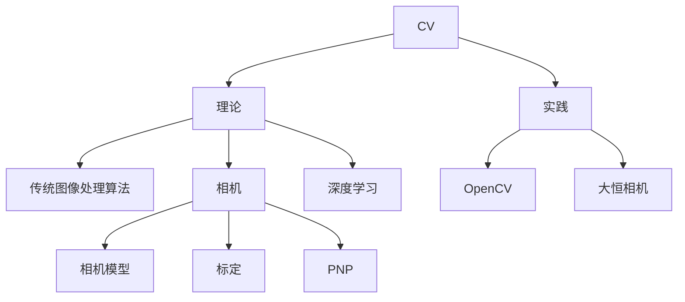

# IRobot 算法组培养路线

- [IRobot 算法组培养路线](#irobot-算法组培养路线)
  - [开发工具链](#开发工具链)
  - [项目通用工具库](#项目通用工具库)
  - [优化工程](#优化工程)
    - [教程和文档](#教程和文档)
  - [计算机视觉（CV）](#计算机视觉cv)
  - [SLAM](#slam)
  - [附录](#附录)
    - [更新日志](#更新日志)

## 开发工具链

- 软件开发
  - C/C++
    - [GDB调试](./assets/GBD调试教程.md)
    - [gprof性能分析](./assets/程序性能检测可视化/程序性能检测可视化.md)
    - Cmake
  - Linux
    - [CAN通信和串口通信](./assets/通信.md)
  - Python和matlab
- 项目管理
  - git
  - Markdown
    - [Mermaid](https://mermaid.nodejs.cn/intro/)
  - [Docker](./assets/docker.md)

## 项目通用工具库

- ROS2（通信框架）
  - [官方文档](https://docs.ros.org/en/foxy/index.html)
  - [鱼香ros](https://fishros.com/d2lros2foxy/)
  - [foxglove可视化工具](./assets/foxglove简易教程.md)

## 优化工程

- 优化工程
  - 设计模式
  - C++特性和标准库
  - 并发编成
    - C++原生并发编程
    - [TBB](https://www.intel.com/content/www/us/en/docs/onetbb/get-started-guide/2021-12/overview.html)
    - [OpenMP](https://www.openmp.org/resources/refguides/)
    - GPU编程
      - CUDA
      - OpenCL
  - 通信协议
    - DDS
### 教程和文档
- 常用的设计模式（策略模式、工厂模式、单例模式等）
   - [基础教程【C++设计模式入门】 ](https://www.bilibili.com/video/BV1Yr4y157Ci/?share_source=copy_web&vd_source=52d55c81781f4ac8050a12c384d3295a)
- 原生并发编程和常用并发库
   - [高性能并行编程与优化 教程](https://github.com/parallel101/course)

## 计算机视觉（CV）

- CV
  - 理论
    - 传统图像处理算法
    - [深度学习-CV](./深度学习-CV/深度学习-CV.md)
    - 相机
      - 相机模型
      - 标定
      - PNP
  - 实践
    - [OpenCV](https://opencv.org/)
    - [大恒相机](https://www.daheng-imaging.com/)

## SLAM

- [SLAM](./SLAM/SLAM.md)

## 附录

### 更新日志

| 版本  | 日期        | 人员                   | 修改记录                                                     |
| ---- | ---------- | ---------------------- | ------------------------------------------------------------ |
| v2.0 | 2024-09-03 | 关超，2533290454@qq.com    | 重新排版                                                |
| v1.4 | 2024-09-01 | 关超，2533290454@qq.com    | 添加工程进阶                                                |
| v1.3 | 2024-03-22 | 段智博，995291627@qq.com   | 细化ros2基础部分要求;添加推荐教程    |
| v1.2 | 2023-12-01 | 李曾阳， 975813725@qq.com  | 添加1.1.6 Git的常用操作；细化 2.1深度学习方向的内容          |
| v1.1 | 2023-11-16 | 吴勇前， 1102567801@qq.com | 添加 *2.2.1 slam基础部分* 的推荐学习课程与方法，细化了里程计与定位方法 |
| v1.0 | 2023-06-25 | 郑桂勇， 2712089295@qq.com | 首次提交                                                     |
