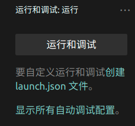
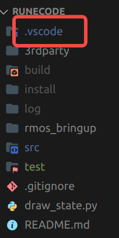
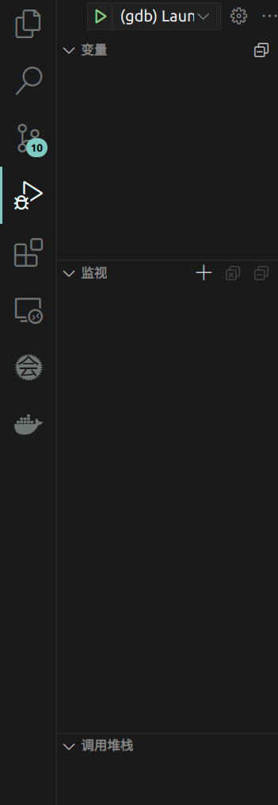
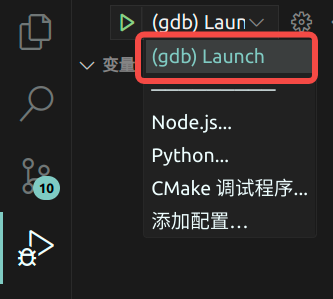

# GBD调试教程
| 版本 | 日期       | 人员                     | 修改记录                                                     |
| ---- | ---------- | ---------------------- | ------------------------------------------------------------ |
| v1.0 | 2024-03-17 | 段壮壮, 995291627@qq.com  | 添加GDB调试教程文档          |

## 什么是GDB?

GDB是一个调试工具。

相信大家在学校学习C语言的时候都用过Dev C++，它的调试功能很简单就可以配置，并且有打断点、实时查看变量等有用的功能。

查看变量？那为啥不直接cout呢？cout确实也能取得一定的效果，但是每次加一个cout，都要重新编译一次程序，时间上不划算。而且，GDB还可以在程序运行过程中更改程序的值、暂停程序等其他的强大功能，便于调试。

## 配置GDB

在我们工作的文件夹下打开VSCode，应该是这个界面

然后打开上图红框内的标志，应该会出现以下界面




如果没出现这个界面，说明之前配置过调试信息。也没关系。跟着我一步一步走即可。


首先需要在我们的工作文件夹下创建一个.vscode文件夹（如果已经有了就不用创了）



在.vscode里面新建一个文件（注意，不是文件夹），文件名称叫```launch.json```


将以下代码复制进 launch.json中：

```json
{
    // Use IntelliSense to learn about possible attributes.
    // Hover to view descriptions of existing attributes.
    // For more information, visit: https://go.microsoft.com/fwlink/?linkid=830387
    "version": "0.2.0",
    "configurations": [
      // Example gdb launch of a ros executable
      {
        "name": "(gdb) Launch",
        "type": "cppdbg",
        "request": "launch",
        "program": "${workspaceFolder}/build/rmos_detector/basic_detector",//"${workspaceFolder}/build/rmos_processer/processer",
        "args": [],
        "stopAtEntry": false,
        "cwd": "${workspaceFolder}",
        "externalConsole": false,
        "MIMode": "gdb",
        "setupCommands": [
          {
            "description": "Enable pretty-printing for gdb",
            "text": "-enable-pretty-printing",
            "ignoreFailures": true
          }
        ],
         "preLaunchTask": "Make source",
      }
    ]
  }
```


此时再看运行与调试，可以看到已经变成这样子了



 launch.json中，需要注意几个参数


- name	就是到时候显示在下图红框框里面的东西

  

  - program 这个的路径是你要调试的文件，被编译后生成的二进制文件。比如我要调试的是basic_detector节点，而basic_detector节点内的文件被cmake编译后生成的二进制文件叫basic_detector，于是就这么导入了。不同节点的文件一般都在build文件夹里。
  
  - preLaunchTask:在launch之前执行的任务。此时我们把任务的标签设置为"Make Source"。下面会告诉大家怎么配置任务。
  
    

## 配置任务

在.vscode里创建一个tasks.json文件。

```json
{
    "version": "2.0.0",
    "tasks":[
        {
            "label":"Make source",
            "type": "shell",
            "command": "source install/setup.bash"
        }
    ]
}
```

label的值要跟上面preLaunchTask的值一样

这个的具体用处。。我还在研究

在加入了这些配置文件后，还需要在CmakeLists里加一条语句：

```cmake
SET(CMAKE_BUILD_TYPE "Debug") 
```

这条语句是让cmake在编译过程中产生调试信息的。如果不加这条语句，就没法进行打断点等操作。

我们每个节点都有一个CMakeLists，到底要在哪个里面加这句话呢？

答案是，你要调试哪个节点，就加到哪个节点的CMakeLists里。


## 运行与调试

前面的配置已经弄好了，接下来就开始调试

首先先编译一下文件```colcon build```

编译完后进入以下界面，并点击绿色小三角


理论上会出现报错，类似这个样子


这是因为没有source导致的。我们看到终端里有个带有小虫子图案的按钮，选中这个终端


结束进程后，在这个终端里source以下


然后再按绿色小三角，发现刚才的报错没啦！

之后就可以设置断点和调试了。

## 待解决的问题
### 如何多节点调试？  
目前的办法是在launch.json里多加几个配置，然后一个个把他们launch起来。有没有launch一次就把节点都launch起来的方法呢？

### 如何默认source，不用此重启VScode都要source一次呢？  
目前的方法是修改.bashrc，有没有改tasks.json的办法？

[官方文档](https://code.visualstudio.com/docs/editor/debugging#_data-inspection)有详细的解释，我还在研究，弄明白了再写在这里。也欢迎大家一起研究~
