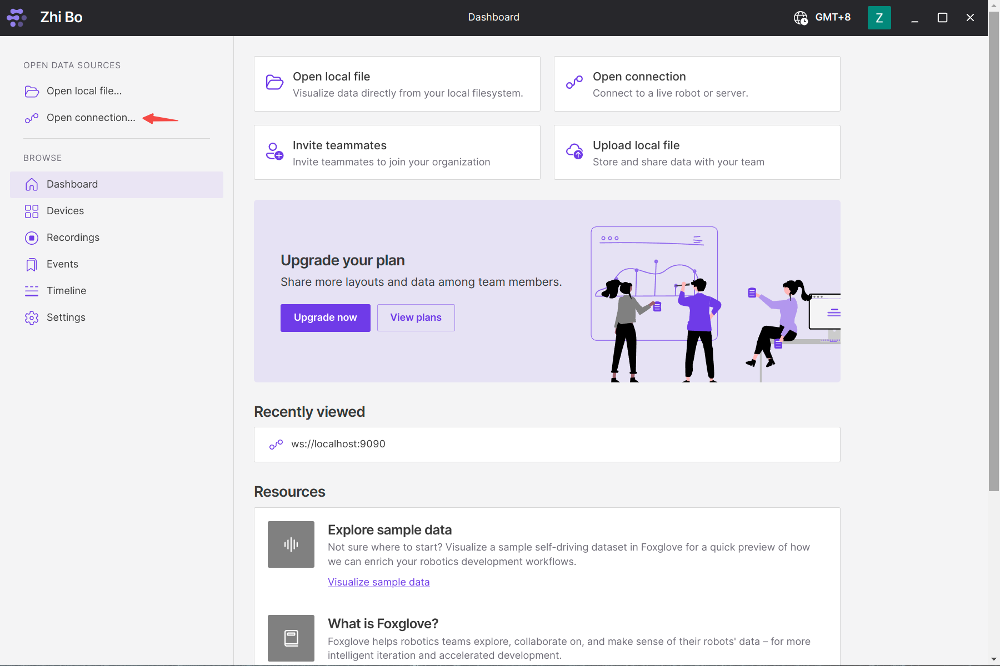
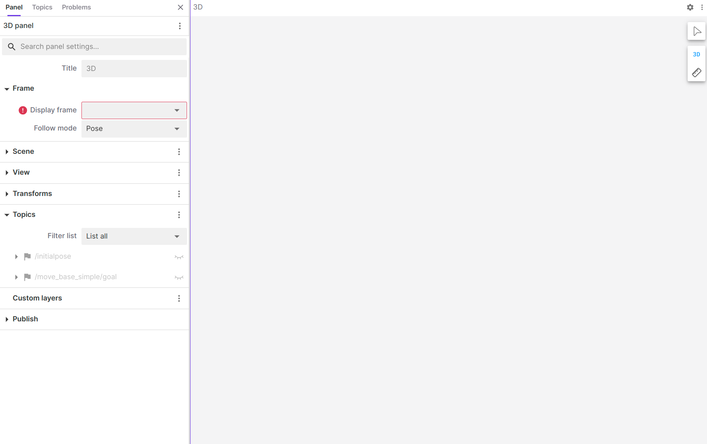

# Foxglove 简易教程
| 版本 | 日期       | 人员                     | 修改记录                                                     |
| ---- | ---------- | ---------------------- | ------------------------------------------------------------ |
| v1.0 | 2024-3-18 | 段智博 ， 995291627@qq.com |  首次创建        |

Foxglove是一个适用于ros的可视化工具。
去官网安装即可。

但因为foxglove默认不支持foxy版本的ros2，所以我们可以安装rosbridge来使用。

安装rosbridge:
```bash
sudo apt-get upgrade
sudo apt-get install ros-foxy-rosbridge-suite
```

启动rosbridge
```bash
ros2 launch rosbridge_server rosbridge_websocket_launch.xml.
```
在foxglove中打开Open connection...

然后如图连接。注意端口号应该和rosbridge的端口号相同

点击左上角带加号的框框可以新建查看数据的面板

点击面板右上角的小齿轮可以进行设置，如选择话题等等。



foxglove还有其他强大功能
官网:
https://docs.foxglove.dev/
详细可去官网查文档